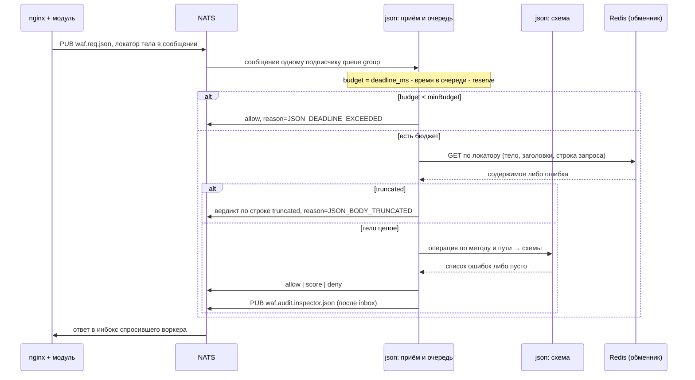

# Инспектор json

Инспектор контракта API: получает сообщение с шины, достаёт из обменника **целое** тело фазы и сверяет
вызов с описанием — OpenAPI 3.0/3.1 или отдельной JSON Schema, — а затем отвечает вердиктом по
`docs/verdict-protocol.md`. Что именно считать описанием, выбирает профиль.

> **Статус.** Реализован. Обе фазы, все исходы таблицы, доставка профилей из
> контроллера и раздел UX работают; инспектор поднят в локальном окружении
> ../../deploy (`deploy`) и проверяется прогоном
> `tests/json` (`docs/tests/json/README.md`).
>
> Внутри — два разборщика: [libopenapi](https://github.com/pb33f/libopenapi)
> с его валидатором для OpenAPI 3.0/3.1 и
> [santhosh-tekuri/jsonschema](https://github.com/santhosh-tekuri/jsonschema)
> v6 для отдельных схем. Ссылки наружу не разрешаются: загрузчик схем
> отключён намеренно.
>
> Не сделано: калибровка `score` по своему трафику (число из профиля, а не
> измеренное), `security:` спеки, XML и form-urlencoded — см.
> [«Что не входит в v1»](#что-не-входит-в-v1). Кадры WebSocket работают первой
> итерацией: сторона клиента, схема по типу сообщения, см.
> [«Кадры WebSocket»](#кадры-websocket).

## Идея одним абзацем

У приложения уже есть контракт — спецификация, по которой писали и клиент, и сервер. Всё, что в него
не влезает, приложением не предусмотрено: лишнее поле, строка вместо числа, отсутствующий
`required`, метод на пути, которого в спеке нет. Инспектор берёт этот контракт как правило допуска
и отвечает `deny` на то, что ему не соответствует. В отличие от сигнатурных инспекторов он ничего
не угадывает: несовпадение со схемой — двоичный факт, как несошедшаяся подпись, и потому вердикт по
умолчанию `deny`, а не `score` (inspectors.md#выбор-между-score-и-deny (`docs/inspectors.md`)).

Обратная сторона: инспектор ровно настолько хорош, насколько актуальна спецификация. Спека, отставшая
от приложения на один релиз, — это отказы живым клиентам. Отсюда `mode=passive` на маршруте и
требование калибровать профиль на живом трафике до включения гейта.

## Что он делает и чего не делает

Делает: разбирает тело как JSON, находит операцию по методу и пути, сверяет тело запроса, тело
ответа, параметры строки запроса, параметры пути, обязательные заголовки, код ответа и его
`Content-Type` с тем, что описано; отдельной JSON Schema сверяет тело без всякого OpenAPI.

Не делает: не чинит и не нормализует тело (модуль отдаёт приложению оригинал всегда), не занимается
семантикой значений (`user_id` из чужой сессии — не его дело), не проверяет авторизацию
(`security:` спеки читается, но не применяется — см. [«Что не входит в v1»](#что-не-входит-в-v1)),
не разбирает XML, protobuf и form-urlencoded, не собирает тело сам — тело кладёт модуль.

## Почему фазы не связаны

Инспектор запроса и инспектор ответа здесь — один процесс и один профиль, но **две независимые
проверки**, и состояния между ними нет. Так вышло не из экономии: операцию спеки инспектор находит
по методу и пути, а `http.method` и `http.uri` приезжают в каждом сообщении, включая фазу ответа
(`docs/verdict-protocol.md`). Всё, что нужно фазе ответа, у неё есть на руках,
и `keep=on` / `resume=` для json не нужны — в отличие от `modsec`, где транзакция движка одна на обе
фазы (`docs/inspectors/modsec/README.md`).

Практические следствия, и все три важны:

- маршрут вправе включить json **только на ответе** — фаза запроса при этом не бежит вовсе;
- политики у фаз свои: тело запроса можно резать `deny`, а расхождение ответа со спекой копить
  счётом, не ломая витрину;
- цена ошибки в спеке на фазе ответа выше: отказ на ответе — это 502 клиенту после того, как
  приложение уже отработало (`README.md`).

## Поток сообщений



Отличие json от остальных инспекторов не в транспорте, а в требовании к содержимому: ему нужно
**целое** тело, и префикс он проверкой не считает. Об этом — отдельный раздел ниже.

## Конфигурация nginx

```nginx
http {
    waf_inspector ip   subject=waf.req.ip;
    waf_inspector json subject=waf.req.json profile=api;

    server {
        location /api/ {
            # Тело едет инспектору целиком: с trim документ обрывается,
            # и «валидно» от «невалидно» уже не отличить.
            client_max_body_size  1m;
            waf_body_limit request  1m block;
            waf_body_limit response 1m trim;

            waf_capture request  headers args body;
            waf_capture response headers body;

            waf_inspect request  ip   wave=0 timeout=5ms;
            waf_inspect request  json wave=1 timeout=30ms;
            waf_inspect response json wave=0 timeout=30ms;

            proxy_pass http://api;
        }
    }
}
```

`waf_body_limit request 1m block` и `... response 1m trim` — не украшение примера, а две разные
политики по построению. На запросе тело крупнее предела не проверено, и отказать ему дешевле, чем
пропустить; на ответе `block` означал бы 502 клиенту из-за размера страницы приложения
(`docs/directives/list/body_limit.md`). Что делает инспектор, когда предел всё-таки
сработал и тело приехало усечённым, решает профиль — см. ниже.

Строка запроса в capture нужна, только если в профиле включена проверка параметров: без `args`
инспектор их не увидит и объявит `query` непроверяемым (`JSON_ARGS_UNAVAILABLE`), а не «пустыми».

## Отдельный конфиг: профиль

```yaml
# profiles/api/profile.yaml
mode: enforce                  # печатает контроллер; режим вызова -- на маршруте (waf_inspect … mode=)
description: "Контракт публичного API"

schema:
  kind: openapi                # openapi | jsonschema
  source: api_openapi          # имя объекта содержимого; рядом лежит файлом schema-api_openapi
  base_path: /api              # что срезать с URI перед сопоставлением с путями спеки

request:
  enabled: true
  checks:
    body: true
    query: true
    path_params: true
    headers: false             # required-заголовки операции
  # Строка на исход: действие и, если это счёт, его вес. Счёт у каждого исхода
  # свой -- «прислал не то» и «вызова нет в контракте» это разные новости.
  policy:
    invalid:           { action: deny }
    unparsable:        { action: deny }
    truncated:         { action: deny }
    unknown_operation: { action: allow }
    content_type:      { action: allow }
    unavailable:       { action: allow }
  deny_response: json_invalid  # имя записи каталога waf_deny_response
  # Инициаторы по исходу: решённый вердикт этой фазы что-то делает наружу --
  # просит соседа или вносит адрес в живой набор. Условие -- само решение.
  outcomes:
    - on: deny                 # deny | allow | score
      list: api_abusers        # субъект -- в живой набор
      write: addr              # addr | net | net_all | asn -- кого писать
      ttl: 1h
      code: JSON_CONTRACT_BAN
    - on: score
      at: 40                   # порог; below: true -- сравнение score < at
      to: captcha
      do: challenge

response:
  enabled: true
  checks:
    body: true
    status: true               # код ответа описан в спеке
    content_type: true         # тип тела описан для этого кода
  policy:
    invalid:           { action: score, score: 40 }
    unparsable:        { action: allow }
    truncated:         { action: allow }
    unknown_operation: { action: allow }
    content_type:      { action: allow }
    unavailable:       { action: allow }
    status:            { action: score, score: 20 }
  only_types: ["application/json", "application/problem+json", "+json"]
  deny_response: json_response_invalid
  outcomes:
    - on: score
      at: 40
      to: vlai
      do: threshold
      delta: 50                # проценты: +50 -- считать этот ответ строже

# Необязательно и только при kind: jsonschema — какую схему применять к чему.
# Первое совпадение выигрывает; без списка схема применяется ко всему телу фазы.
bindings:
  - methods: [POST, PUT]
    path: /api/orders
    match: prefix              # exact | prefix
    schema: order_create
  - methods: [POST]
    path: /api/users
    match: exact
    schema: user_create

limits:
  max_body: 1m                 # тело крупнее не разбираем: исход как у truncated
  max_depth: 64                # глубина вложенности JSON
  max_errors: 20               # сколько находок уезжает в аудит
  cache: 4096                  # скомпилированных схем в памяти процесса

audit:
  values: off                  # off | hash — значения полей в находках. По умолчанию их нет
  paths: true                  # instance_path находки (/items/3/price)
```

Профили лежат каталогом, перечитываются по отпечатку — как у auth (`docs/inspectors/auth/README.md`) и
captcha (`docs/inspectors/captcha/README.md`). Режима у профиля в панели нет: включён ли контракт и гейтит ли
он, решает вызов на маршруте (`waf_inspect … mode=active|passive|vote|off`); увидеть, сколько живого
трафика спека не описывает, не заперев клиентов, — `mode=passive` там. Файловые `mode: observe`
(модулю всегда `allow` с кодом `JSON_OBSERVE`, в аудите — что решил бы) и `mode: off` (`allow` без
разбора) загрузчик ещё понимает.

Секция `limits` — свойство процесса, а не профиля: объявляется в профиле, потому что там её ищут,
расхождение между профилями отвергает поколение целиком.

### Просьбы соседей: `trigger.prior`

Инспектор — слушатель двух глаголов канала действий (`docs/inspector-actions.md`), и просьба
значит что-то только через правило в профиле:

```yaml
trigger:
  prior:
    - from: ip                # имя отправителя; "*" не принимается: оба глагола умеют ослаблять
      accept: [threshold, skip]
      codes: [IP_ALLOWLIST]   # пусто — любой повод
```

`threshold` — коэффициент к счёту, который инспектор отдаёт модулю на этом запросе: `delta` —
проценты, множитель `1 + delta/100`; минус — скидка, плюс — поведение клиента дороже. Пороги — и
правил профиля, и маршрута — не двигаются. Потолка на `delta` в правиле нет: просьба берётся
целиком, величину держит загрузчик отправителя, прижимается только сумма (−100…+900); ключ
`max_percent` старых профилей читается и игнорируется одно поколение. `skip` снимает проверку до контракта и обменника: `allow` с
кодом `JSON_SKIPPED`. Исход каждой доставленной просьбы и тройка
`score_raw`/`score_scale_percent`/`score_scaled` — в `kind=inspector`.

### Инициаторы по исходу: `outcomes`

Приём — половина канала; вторая половина в том, что инспектор контракта **сам говорит соседям**.
Форма та же, что у [ip](https://github.com/exemt/placitum-ip/blob/develop/docs/README.md): «когда → что сделать», где «когда» — собственный решённый
исход, а не повторение его предпосылок. Условие, записанное второй строкой, разъехалось бы с первой
на первой же правке политики.

```yaml
request:
  outcomes:
    - on: deny                 # deny | allow | score
      list: api_abusers        # субъект -- в живой набор
      write: net               # addr | net | net_all | asn -- кого писать
      ttl: 1h
      code: JSON_CONTRACT_BAN  # повод; пусто -- код решения (JSON_*)
    - on: score
      at: 40                   # порог: score >= 40
      below: false             # true -- сравнение в другую сторону, score < at
      to: captcha              # кому; "*" -- всем
      do: challenge
      apply: request
```

Три триггера, и все три — вердикт этой фазы:

| `on` | Когда срабатывает |
| --- | --- |
| `deny` | политика фазы решила отказать |
| `allow` | фаза закончилась пропуском, в том числе на исходе «сошлось» |
| `score` | вердикт `score`, и счёт прошёл сравнение: `>= at`, либо `< at` при `below: true` |

Сравнивается тот счёт, который уходит модулю, — то есть уже с коэффициентом `threshold` соседа, если
он был. Иначе получилось бы, что оператор смотрит на одно число, а сосед двигает другое.

Действие ровно одно из двух:

- **просьба соседу** — `to` + `do` (+ `apply`, `delta`, `value`, `code`): та же форма, что у любого
  отправителя канала, те же пределы, тот же аудит. Просьбы на `on: deny` не бывает — отказ обрывает
  фазу, и волн, которым она адресована, уже не будет;
- **запись в живой набор** — `list` + `write` + `ttl` (+ `code`): в набор уезжает субъект —
  адрес клиента (`addr`), эффективный анонс, в который он попал (`net`), все анонсы над адресом,
  включая чужие широкие (`net_all`), либо состав его системы целиком (`asn`), — одним событием
  keeper `waf.sets.<набор>.event` (пачка `values[]`, вся или никак), `origin` — имя инспектора.
  Состав ведёт keeper: запись видят соседние ноды и панель, где её можно снять руками. Анонсы и
  состав системы инспектор узнаёт у кодера гео по gRPC (`WAF_JSON_GEO_ADDR`), ждёт его синхронно в
  бюджете сообщения и кэширует кусками; спрашивает только тогда, когда строка того требует — на
  профиле без `write: net|net_all|asn` кодер не дёргается ни разу. Кодер нужен и молчит — ответ
  `error` с кодом `JSON_GEO_UNAVAILABLE`, исход выбирает `waf_exception` маршрута. Виды те же, что
  у всех отправителей (modsec (`docs/inspectors/modsec/README.md`)):
  адрес меняется дешевле всего, анонс — уже нет, а система целиком — решение другого масштаба.

Просьба с фазы **ответа** доезжает: `prior` сквозная по фазам, и высказанное на ответе видят поздние
волны этой же фазы. Запись в набор с ответа тем более осмысленна — она про следующие запросы.

**Файловый `mode: observe` глушит только ответ модулю.** Инициаторы судят по решению `enforce` и стреляют
как в бою: просьба уезжает соседу под поводом решения (`JSON_SCHEMA_MISMATCH`), запись в набор
делается. Модулю уходит `allow` с кодом `JSON_OBSERVE`, а в `kind=inspector` — `engine.passive: true`,
`would_verdict`, `would_code` и `would_score`. Общий контракт наблюдения —
`docs/inspectors.md`.

Ограничения загрузчика (`internal/config/profile.go`) — те же, что у соседей: глагол обязан быть в
словаре (`docs/inspector-actions.md`) и слушаться получателем, ось — допустимой при этом
глаголе, `delta` — обязательна у `threshold` и лежит в −100…900 процентов, `ttl` обязателен при
`list`, `at` — только у `score` и обязателен там. Профиль с опечаткой не поднимается.

## Исходы и политики

Одно правило на все исходы: **инспектор не решает молча**. Каждый исход, кроме «сошлось», называется
машинным кодом и разбирается политикой профиля; вердикт по умолчанию у неопределённого исхода —
`deny` на запросе и `score` либо `allow` на ответе, потому что цена ошибки на фазах разная.

| Исход | Строка политики | Код | Умолчание запрос / ответ |
| --- | --- | --- | --- |
| Не сошлось со схемой | `invalid` | `JSON_SCHEMA_MISMATCH` | `deny` / `score 40` |
| Документ глубже `max_depth` | `invalid` | `JSON_TOO_DEEP` | `deny` / `score 40` |
| Параметр или заголовок не сошёлся | `invalid` | `JSON_SCHEMA_MISMATCH` | `deny` / — |
| Тело не разбирается как JSON | `unparsable` | `JSON_UNPARSABLE` | `deny` / `allow` |
| Тело усечено (`truncated`) | `truncated` | `JSON_BODY_TRUNCATED` | `deny` / `allow` |
| Тело крупнее `limits.max_body` | `truncated` | `JSON_BODY_TOO_LARGE` | `deny` / `allow` |
| Вызова нет в контракте | `unknown_operation` | `JSON_UNKNOWN_OPERATION` | `allow` / `allow` |
| Тип тела не описан | `content_type` | `JSON_CONTENT_TYPE` | `allow` / `allow` |
| Код ответа не описан | `status` | `JSON_STATUS_UNDECLARED` | — / `score 40` |
| Обменник не отдал тело | `unavailable` | `JSON_BODY_UNAVAILABLE` | `allow` / `allow` |
| Строки запроса нет в capture | `unavailable` | `JSON_ARGS_UNAVAILABLE` | `allow` / — |

Строк политики восемь, кодов больше: две пары исходов делят строку намеренно.
Слишком глубокий документ судится как несошедшийся со схемой — и то и другое
«документ не такой, каким его ждут». Слишком крупное тело — как усечённое: и там
и там мы его не проверяли. Разводить их по отдельным строкам значило бы
предлагать оператору настройку, разницу между половинами которой он не сможет
объяснить; код в аудите при этом остаётся своим у каждого исхода.

Исходы ниже строк политики не имеют вовсе — спорить с ними профилю нечем:

| Исход | Код | Вердикт |
| --- | --- | --- |
| Профиля нет | `JSON_UNKNOWN_PROFILE` | `error` |
| Фаза не обслуживается | `JSON_PHASE_NOT_SUPPORTED` | `error` |
| Сообщение не разобрано | `JSON_MALFORMED_REQUEST` | `error` |
| Версия схемы не та | `JSON_UNSUPPORTED_VERSION` | `error` |
| Обменник не отдал объект | `JSON_STORE_UNAVAILABLE` | `error` |
| Фаза выключена профилем | `JSON_PHASE_DISABLED` | `allow` |
| Профиль выключен (файловый `mode: off`) | `JSON_PROFILE_OFF` | `allow` |
| Очередь полна | `JSON_QUEUE_LIMIT` | `error` |
| Внутренняя ошибка, паника | `JSON_INTERNAL_ERROR` | `error` |

Параметры и заголовки своей строки политики не получают намеренно: с точки зрения решения это то же
самое «не сошлось с описанием», и разводить их значило бы предлагать оператору разрешить кривой `id`
в пути, запретив кривой `id` в теле. Где именно нашли, видно в находке: `target` у неё `args`, `uri`
или `header:<имя>`.

Нижняя таблица профиль не спрашивает, и вердикт в ней один на все настоящие сбои — `error`,
«проверить не смог». Расхождение конфигурации (`JSON_UNKNOWN_PROFILE`, `JSON_PHASE_NOT_SUPPORTED`,
`JSON_MALFORMED_REQUEST`, `JSON_UNSUPPORTED_VERSION`), перегрузка (`JSON_QUEUE_LIMIT`,
`JSON_INTERNAL_ERROR`) и молчание обменника (`JSON_STORE_UNAVAILABLE`) раньше расходились: одни
отвечали `deny`, другие `allow`, и обе половины были догадкой инспектора о том, что важнее на этом
маршруте. Теперь это говорит маршрут — `waf_exception <фаза> inspector pass|deny`
(`docs/directives/list/deadline.md`). `JSON_PHASE_DISABLED` и `JSON_PROFILE_OFF`
остаются `allow`: это просьба оператора не проверять, а не сбой.

Строка `unavailable` профиля описывает ровно один случай: тела не дал **маршрут** — не снимал его в
`waf_capture`, обменник не принял, размер вышел за лимит. Такую недоступность обнаружил модуль, и он
же ею распорядился (`waf_exception … body`); раз сообщение всё-таки дошло, решение было
«продолжать», и что делать дальше — вопрос к профилю, отсюда и умолчание `allow`.

Обменник, не отдавший объект **нам** (`store_error`, `decrypt_failed`, `digest_mismatch`), под эту
строку не подпадает: модуль о таком не знает — он положил тело и считает его на месте. Контракт не
проверен по нашей вине, и это `JSON_STORE_UNAVAILABLE` с вердиктом `error`.

## Полное тело и усечение

Это главное требование инспектора к маршруту, и оно жёстче, чем у всех остальных.

JSON — не поток: у документа есть закрывающая скобка, и без неё он не документ. Префикс тела не
«частично валиден» — он **невалиден всегда**, и любая схема на нём даёт ошибку `unexpected end of
input`. Отсюда правило: усечённое тело инспектор не валидирует вовсе. Он не пытается угадать, что
там было дальше, не проверяет «то, что успело приехать», и не выдаёт `allow` молча — молчаливая
трактовка префикса как целого документа и есть тот самый ложный пропуск, о котором предупреждает
`docs/inspectors.md`.

Три способа получить усечённое тело, и все три ведут в один исход:

| Откуда | Что видит инспектор |
| --- | --- |
| `waf_body_limit <фаза> <size> trim` | `store.body.truncated: true` |
| `waf_capture <фаза> body=<size>` меньше тела | `store.body.truncated: true` |
| Тело целое, но крупнее `limits.max_body` профиля | `JSON_BODY_TOO_LARGE`, разбор не начинался |

Решение принимает строка `truncated` таблицы политик, и выбор ровно из двух осмысленных:

**`truncated: { action: deny }`** — «непроверяемое не проходит». Это позиция для маршрута с контрактом:
клиент, приславший тело крупнее объявленного предела, нарушил контракт уже этим. Отказ отдаёт запись
каталога `deny_response` профиля.

**`truncated: { action: allow }`** — «непроверяемое проходит с пометкой». Позиция для фазы ответа и для
маршрутов, где крупные тела законны, а json стоит ради типовых ошибок, а не ради гейта. В аудит
уходит `truncated: true` и размеры, и по ним видно, какая доля трафика проверку не проходила вовсе.

Третий вариант — `score` — не запрещён, строка политики принимает его как любая другая, но
осмысленного применения у него мы не нашли: усечение говорит о размере тела, а не о его
подозрительности, и добавлять за него баллы значит наказывать за конфигурацию маршрута.

Правильная настройка маршрута — не доводить до усечения: `waf_body_limit request` ставится по
реальному потолку API и `block`, а `waf_capture request body` — не меньше него. Тогда
строка `truncated` не срабатывает никогда, и это нормальное состояние. Инспектор считает
`json_truncated_total` отдельной метрикой именно для того, чтобы расхождение было видно.

## Как находится операция

При `kind: openapi` инспектор обязан из метода и URI получить операцию спеки. Порядок такой:

1. **Срезается префикс.** `base_path: /api` превращает `/api/orders/42` в `/orders/42`. Это
   типовой случай: спека написана от корня сервиса, а location стоит на префиксе. Срезается он
   посегментно: `/api` не срезается у `/api-v2/orders`, иначе один маршрут молча ломал бы соседний.

   Префиксы из `servers[].url` самого документа маршрутизатор срезает **всегда**, и настройки для
   этого нет: тумблер «брать из servers[]» означал бы, что без него они не срезаются, — а это
   неправда. `base_path` нужен ровно там, где префикс маршрута в документе не описан вовсе.
2. **Отбрасывается строка запроса.** Она проверяется отдельно, как параметры, и в сопоставлении
   пути не участвует.
3. **Сопоставляется шаблон.** `/orders/{id}` матчится сегментами; конкретный сегмент выигрывает у
   шаблонного (`/orders/new` побеждает `/orders/{id}`), как того требует OpenAPI.
4. **Ищется метод.** Путь нашёлся, метода в нём нет — это `JSON_UNKNOWN_OPERATION`, а не «путь не
   найден»: разница видна в аудите, потому что второе почти всегда означает промах `base_path`.

`on_unknown_operation: allow` по умолчанию — потому что маршрут почти всегда шире спеки: на том же
location живут `/health`, статика, служебные пути. Профиль `strict` ставит `deny` и превращает
инспектора в белый список путей — это законное и осознанное применение, но включать его надо после
`observe`, иначе первым же отказом уедет что-нибудь безобидное.

При `kind: jsonschema` операции нет вовсе: схему выбирает список `bindings` по методу и пути, а без
списка одна схема применяется ко всему телу фазы.

## Что именно проверяется

| Проверка | Фаза | Откуда данные | Ключ |
| --- | --- | --- | --- |
| Тело против `requestBody.content[<type>].schema` | запрос | обменник, `body` | `checks.body` |
| Тело против `responses[<code>].content[<type>].schema` | ответ | обменник, `body` | `checks.body` |
| Параметры `in: query` | запрос | обменник, `args` | `checks.query` |
| Параметры `in: path` | запрос | `http.uri` | `checks.path_params` |
| Параметры `in: header`, `required: true` | запрос | обменник, `headers` | `checks.headers` |
| Код ответа описан в спеке | ответ | `response.status` | `checks.status` |
| `Content-Type` ответа описан для кода | ответ | обменник, `headers` | `checks.content_type` |

Заголовки по умолчанию выключены: спеки часто перечисляют `X-Request-Id` и подобное как
обязательное, а на живом трафике оно приходит не от клиента, а от края — включать эту проверку без
разбора значит отказать половине запросов.

`only_types` фазы ответа — фильтр до всего остального: тело с `Content-Type: text/html` инспектор
не разбирает как JSON и отвечает `allow`, не трогая политики. Суффикс `+json` покрывает
`application/problem+json`, `application/vnd.api+json` и прочие структурированные типы.

## Вердикт, счёт и аудит

В ответ уходит решение и один код причины. Список ошибок валидации — в событие `kind=inspector`,
после ответа в инбокс: подробностями дедлайн волны двигать нельзя
(`docs/inspectors.md`).

Счёт берётся из строки политики того исхода, который сработал, и не зависит от числа ошибок. Два
решения здесь, и оба стоят объяснения.

**Счёт свой у каждого исхода.** Один счёт на фазу означал бы, что «ответ не по спеке» и «код ответа
не описан» весят одинаково; на живом трафике это разные новости, и складываться в сумму фазы они
обязаны по-разному. Вопрос «сколько баллов добавит вот эта строка» задают про конкретный исход —
ответ стоит рядом с ним, в той же строке таблицы.

**Число ошибок на счёт не влияет.** Соблазн считать «чем больше ошибок, тем выше балл» мы отвергли:
количество ошибок в JSON Schema — свойство того, как написана схема (`oneOf` из пяти вариантов даёт
пять ошибок на одном поле), а не тяжести нарушения. Шкала, которую нельзя объяснить, хуже
отсутствующей — см. `docs/inspectors.md`.

Порог остаётся у маршрута: `deny` инспектор произносит сам, а сумму со счётом сравнивает модуль
(`waf_score_deny`). Поэтому в профиле нет и не будет «порога профиля» — он живёт там, где видно всю
картину волны.

**Значений полей в аудите нет.** Находка — это `instance_path`, ключевое слово схемы (`required`,
`type`, `pattern`), `schema_path` и текст ошибки без подстановки значения. Причина простая: тело
запроса к API — это ровно то место, где лежат пароли, токены и персональные данные, а аудит уезжает
в ClickHouse и живёт там месяцами.

`audit.values: hash` добавляет к находке усечённую sha256 значения — восемь байт. Этого хватает,
чтобы сравнить два инцидента между собой («тот же токен в том же поле»), и не хватает, чтобы
перебрать короткое значение по словарю. Открытым текстом значение не уезжает никогда, а при
`values: off` тело ради хеша даже не разбирается второй раз.

```json
{
  "v": 1, "kind": "inspector", "inspector": "json", "ray": "…",
  "verdict": "deny", "reason": "JSON_SCHEMA_MISMATCH",
  "detail": {
    "profile": "api", "phase": "request",
    "schema": "openapi:api_openapi", "operation": "POST /orders",
    "errors": 3, "truncated": false, "body_bytes": 812, "parse_us": 41,
    "findings": [
      { "path": "/items/3/price", "keyword": "type", "schema": "#/properties/items/items/properties/price", "message": "expected number, got string" },
      { "path": "/customer", "keyword": "required", "schema": "#/required", "message": "missing property \"email\"" }
    ]
  }
}
```

## Дедлайн, бюджет и кеш

Валидация — это разбор JSON плюс обход дерева схемы, и стоит она предсказуемо: единицы сотен
микросекунд на теле в килобайты. Дорогие места два, и оба закрываются заранее:

**Компиляция схемы.** Спека компилируется один раз при загрузке профиля, а не на запросе. Загрузка
профиля с неразбираемой спекой — ошибка старта, а не сюрприз на первом сообщении: инспектор,
который из-за опечатки в YAML начинает всё пропускать, хуже не запустившегося.

**Разбор тела.** Ограничен `limits.max_body` и `limits.max_depth`. Глубина проверяется на разборе, а
не после: «json bomb» из десяти тысяч вложенных массивов кладёт рекурсивный обход, а не схему.

Бюджет считается как у остальных: `deadline_ms` минус время в очереди минус резерв. Не хватило —
`JSON_DEADLINE_EXCEEDED`; полная очередь — `JSON_QUEUE_LIMIT`. Оба отвечаются вердиктом `error`, и
исход выбирает маршрут. Исход `budget` из профиля снят (091): он говорил то же самое, но словами
инспектора и мимо конфигурации nginx.

## Профили из контроллера

Устроено один в один как у auth (`docs/inspectors/auth/README.md`) и
captcha (`docs/inspectors/captcha/README.md`): черновик в Postgres, `send` собирает
поколение, инспектор забирает его из JetStream KV, в манифесте — текст `profile.yaml` и текст самой
спецификации, разбор строгий, bootstrap из образа остаётся.

| Слой | Где |
| --- | --- |
| Черновик | `json_profiles.doc` (jsonb) |
| Спецификация | файл раздела данных (`datasets.kind = 'content'`, раздел «Файлы»), поле `schema.source`, едет файлом `schema-<имя>` |
| API | `/api/<scope>/json/profiles`, `/send`, `/desired` |
| Поколение | KV `WAF_DESIRED/policy/json` |
| Каталог инспекторов | запись `json`, subject `waf.req.json`, фазы `request,response` — миграцией |
| Каталог отказов | `json_invalid` (400) и `json_response_invalid` (502) — миграцией в каждое пространство |
| Раздел UX | `/json` — профили; спецификации — в разделе данных, `/datasets/files` |

Проверки контроллера на записи (класс ошибки → что означает):

| Код | Когда |
| --- | --- |
| `invalid_profile` | документ не проходит проверку формы: политика не из словаря, счёт вне 0..100, обе фазы выключены, привязки при `kind: openapi`, отказ без записи каталога |
| `schema_not_found` | `schema.source` или `bindings[].schema` не найдены среди объектов содержимого пространства |
| `schema_empty` | объект есть, тело пустое |
| `deny_response_unknown` | имя записи отказа не в каталоге пространства |
| `default_is_required` | попытка переименовать или удалить профиль `default` |
| `missing_default` | на `send`: профиля `default` нет, а поколение без него инспектор отвергнет целиком |
| `invalid_profile_name` | имя профиля не годится именем каталога на ноде |
| `schema_name_invalid` | имя объекта не годится именем файла на ноде |

Разбор самой спецификации остаётся на ноде: контроллер её не компилирует. Документ, который не
разберётся, виден как `apply_failed` в пульсе — и это единственная ошибка, которую панель не ловит
на записи. Компилировать OpenAPI в контроллере значило бы завести второй разборщик, который обязан
совпадать с первым до мелочей; вместо этого поколение отвергается целиком и старое остаётся
работать.

## Раздел UX

Страница `/json` — таблица профилей и панель справа с секциями, как `CaptchaProfiles.tsx`. Секции —
`TableBlock`, строка = директива профиля, вторичное — в диалоги
(section-tables (`docs/inspectors/captcha/README.md`)).

| Секция | Строки |
| --- | --- |
| Профиль | имя, описание, режим |
| Схема | чем описан контракт, спецификация (селектор из файлов), срезаемый префикс |
| Фаза запроса | фаза проверяется; четыре флага проверок; запись отказа; **таблица политик** |
| Фаза ответа | то же плюс код ответа, тип тела и `only_types`; своя таблица политик |
| Привязки | только при `kind: jsonschema`: методы, путь, совпадение, схема |
| Пределы и аудит | тело до, глубина, находок в аудит, кеш схем, значения полей, пути находок |

Таблица политик — строка на исход, колонки «Исход», «Действие», «Счёт». Под именем исхода стоят коды
причин, которые он даёт: по ним оператор связывает строку настройки со строкой аудита, не открывая
документацию. Ячейка счёта заперта у `deny` и `allow` — число там ничего не значит, а пустое место на
его месте читалось бы как ноль.

Всё остальное — строки таблицы настроек: слева имя с ⓘ, справа редактор. Отдельных абзацев-подсказок
в карточке нет: текст ищут у той строки, к которой он относится.

Селектор схемы — «объявить» из существующих файлов, не «создать»: спецификация живёт в разделе
данных («Файлы»), как страница капчи и форма входа, и заводится там же. Блок привязок показывается только при
`kind: jsonschema` — при OpenAPI операцию выбирает сама спека, и второй список правил рядом означал
бы два источника истины.

## На стенде

Служба `inspector-json` (две реплики), профили `default` (выключен), `api`
(гейт на запросе, счёт на ответе), `strict` (белый список путей и гейт на
ответе), `observe` (наблюдение), `soft` (усечённое тело проходит) и `_probe`
(проба). Спецификация стенда — контракт эхо-приложения `backend`: `/orders`,
`/orders/{id}`, `/report`, `/fail`, `/healthz`.

```sh
sh tests/json/json.sh
```

| Маршрут | Профиль | Чем интересен |
| --- | --- | --- |
| `/json/` | `api` | Обе фазы; тело и параметры гейтят, ответ скорит |
| `= /json/trim` | `api` | `waf_body_limit request 256 trim` — ветка отказа на усечении |
| `/json-strict/` | `strict` | Путь вне спеки и ответ не по спеке — отказ |
| `= /json-strict/fail` | `strict` | Апстрим отвечает 503, операция объявляет только 200 |
| `/json-observe/` | `observe` | Вердикт считается целиком, наружу `allow` |
| `/json-soft/` | `soft` | Мягкие политики: расхождение скорит; на второй волне стоит капча — получатель просьб инициатора |
| `= /json-soft/trim` | `soft` | Тот же префикс тела — ветка пропуска |

**Инициаторы проверяются насквозь, а не по логу.** У профиля `soft` две строки:
на счёте выше 50 попросить капчу (`challenge`, повод `WANT_CAPTCHA`) и записать
адрес клиента в `cap_ipban` на минуту. Капча объявлена на том же маршруте
второй волной, поэтому тело не по спеке заканчивается её отказом
`CAPTCHA_REQUIRED`, а запись видна в базе с `origin: json`; прогон снимает её
за собой — набор режет соседние маршруты капчи.

Канал действий требует **свежего образа nginx**: модуль переносит просьбы
между инспекторами, и образ, собранный до появления канала, молча их теряет —
инспектор отдаёт `actions`, а получатель не видит ничего. Проверяется одной
строкой: `grep -a -c waf_actions_max /usr/lib/nginx/modules/ngx_http_waf_module.so`
внутри контейнера края.

Профили стенда лежат и в образе (`inspectors/json/profiles`), и в контроллере:
после `send` каталог из образа подменяется поколением из KV, и прогон остаётся
зелёным — этим и проверяется, что YAML контроллера читается загрузчиком
инспектора. Сверка вручную:
`JSON_PROFILES_DIR=<dir> go test ./internal/validate`.

## Состав каталога

```
inspectors/json/
├── cmd/inspector/     шина, waf.req.json, обе фазы
├── cmd/probe/         healthcheck: сообщение с профилем _probe → ожидает deny
├── internal/protocol/ формат сообщений, копия общего пакета
├── internal/body/     получение объектов обменника по локатору
├── internal/config/   окружение, inspector.conf, профили и их горячая замена
├── internal/schema/   компиляция OpenAPI и JSON Schema, поиск операции, находки
├── internal/validate/ порядок проверки одного сообщения
├── internal/decide/   политика профиля → вердикт: чистая функция от исхода
├── internal/desired/  поколение из KV, раскладка на диск
├── internal/audit/    событие kind=inspector
├── internal/queue/    очередь и admission control
├── internal/pulse/    кадр присутствия, internal/flow и internal/host рядом
├── profiles/          default, api, strict, observe, soft, _probe
└── deploy/            Dockerfile
```

Пакеты `protocol`, `body`, `queue`, `pulse`, `audit`, `desired`, `flow`, `host` — копии общих
пакетов с заменой import-пути, как у капчи. Четвёртая копия делает вынос в общий модуль неизбежным,
и это отдельный рефакторинг, на поведение не влияющий.

Разделение `schema` / `validate` / `decide` — не слои ради слоёв. `schema` знает про OpenAPI и
JSON Schema и ничего не знает про обменник; `validate` знает про обменник и порядок проверок и ничего не
знает про вердикты; `decide` знает только политику профиля и не делает ввода-вывода вовсе. Отсюда и
тесты: политику проверяют без сети, а разбор — без профиля.

## План разработки

Все этапы закрыты 2026-08-24.

| Этап | Объём | Критерий выхода |
| --- | --- | --- |
| 1. Каркас — **закрыт** | образ, `cmd/inspector`, общие пакеты (копии), `config` + профили из образа, `schema` + `validate` + `decide`, обе фазы, проба `_probe` | инспектор поднят на стенде, валидное тело → `allow`, невалидное → `deny` |
| 2. Политики и тело — **закрыт** | все исходы таблицы, `truncated` обеими ветками, `limits`, аудит без значений | `tests/json/json.sh` зелёный, включая `trim` на обеих политиках |
| 3. OpenAPI целиком — **закрыт** | параметры query / path / header, статус и content-type ответа, `base_path` и `servers`, `bindings` для jsonschema | контракт стенда проверяется целиком, `strict` работает белым списком |
| 4. Контроллер — **закрыт** | миграция `050_json_profiles.sql`, `json-profile-doc.ts` / `json-profiles.ts` / `json-http.ts` / `json-manifest.ts`, KV `policy/json`, канал сходимости | профиль из панели доезжает до инспектора (`desired applied`), прогон стенда проходит на поколении из KV |
| 5. Раздел UX — **закрыт** | `/json`: таблица профилей, панель с секциями, селектор схемы из файлов раздела данных, кнопка «Разослать» | профиль заводится и правится из панели |

## Кадры WebSocket

> **Статус (04.09.2026).** Первая итерация сделана насквозь: секция `frame` профиля с привязками
> по направлению и дискриминатору (`internal/config`, `internal/schema/frame.go`), ветка фазы в
> `internal/validate` и обработчике, секция в документе контроллера, манифест, каталог (миграция
> `077_frame_phase.sql`: фаза `frame` у процессов json и modsec, запись `ws_policy`
> `type=websocket`), раздел панели «Кадры WebSocket» и фаза кадров на маршруте. Модуль ведёт
> сторону клиента в `gate` (streaming.md#websocket (`docs/streaming.md`)); профиль `ws`
> поставки и прогон [nginx/tests/ws](https://github.com/exemt/placitum-node/blob/develop/docs/tests/websocket.md) — приёмка.
>
> Отличия от раздела ниже, записанного до реализации: полезная нагрузка едет **локатором
> обменника**, как тело на других фазах, а не инлайном; сборки фрагментов в модуле ещё нет — фрагмент
> приезжает своим кадром и на JSON-контракте не разбирается (`unparsable`); политики `s2c`
> хранятся и печатаются, но модуль эту сторону не читает; двоичный кадр — исход `opcode`
> (`JSON_FRAME_OPCODE`), продолжение судится как текст. Остальное совпадает с написанным.

### Что уже было

Реализация опиралась на готовое, и это важно для оценки объёма:

- протокол вердиктов знает фазу `frame`, форма сообщения кадра описана
  (streaming.md#идентификация (`docs/streaming.md`)): `conn_id`, `seq`, секция
  `stream` с направлением, опкодом и подпротоколом, а `http.method` и `http.uri` рукопожатия едут в
  каждом кадре;
- в контроллере тип фазы `frame` был в модели маршрута и в ручке объявлений; заглушка в
  `nginx-emit` заменена печатью `frame:c2s` у вызова, бюджета, порога, снимка и предела тела;
- прогон [nginx/tests/ws](https://github.com/exemt/placitum-node/blob/develop/docs/tests/websocket.md) держал две строки «покрытия нет», и
  они стали приёмочным тестом.

### Почему json ложится на кадры без насилия

Главный принцип инспектора — состояния между фазами нет, операция ищется по тому, что приехало в
сообщении, — на кадрах сохраняется как есть. Фаза кадра становится **третьей независимой проверкой**
рядом с запросом и ответом: у неё свои политики, свои инициаторы, свой аудит, и ни одного байта
состояния по `conn_id` инспектор не держит. Что кадр — единица решения, а счёт обнуляется на каждом,
решил модуль (streaming.md#вердикт-по-кадру (`docs/streaming.md`)); инспектору это
только на руку.

Разница ровно одна, и она в том, **по чему искать операцию**. У OpenAPI нет понятия сообщения в
сокете, а в одном соединении обычно ездят разные типы сообщений вперемешку: `{"type":"join"}`,
`{"type":"msg"}`. Роутинг по методу и пути заменяется на роутинг по **направлению и дискриминатору в
теле**. Это не новая сущность, а расширение уже существующих `bindings` у `kind: jsonschema`, где
`path` сравнивается с URI рукопожатия.

### Профиль: секция `frame`

```yaml
schema:
  kind: jsonschema             # на кадрах только jsonschema: openapi-профиль с frame не поднимается

frame:
  enabled: true
  # Первое совпадение выигрывает, как у bindings запроса. path -- URI рукопожатия.
  bindings:
    - path: /ws/chat
      match: prefix
      direction: c2s           # c2s | s2c | any
      subprotocol: chat.v2     # пусто -- любой
      discriminator: { pointer: /type, value: msg }
      schema: chat_msg_c2s
    - path: /ws/chat
      direction: c2s
      discriminator: { pointer: /type, value: join }
      schema: chat_join
    - path: /ws/chat
      direction: s2c
      schema: chat_any_s2c     # без дискриминатора: одна схема на всё направление
  c2s:
    checks: { body: true }
    policy:
      invalid:           { action: deny }
      unparsable:        { action: deny }
      truncated:         { action: deny }
      unknown_operation: { action: deny }   # тип сообщения не описан: контракт как белый список
      opcode:            { action: deny }   # binary там, где контракт про text
      unavailable:       { action: allow }
    deny_response: ws_policy               # type=websocket code=1008
    outcomes:
      - on: deny
        list: ws_abusers
        write: addr
        ttl: 1h
  s2c:
    checks: { body: true }
    policy:
      invalid:           { action: score, score: 40 }
      unparsable:        { action: allow }
      truncated:         { action: allow }
      unknown_operation: { action: allow }
      opcode:            { action: allow }
      unavailable:       { action: allow }
    outcomes:
      - on: score
        at: 40
        to: vlai
        do: threshold
        delta: 50
```

Решения, которые стоит принять сейчас, а не при реализации:

- **Политики по направлению, а не одна на фазу.** `c2s` — аналог запроса: отказ в режиме `gate` — это
  Close 1008 до доставки приложению, и `deny` уместен. `s2c` — аналог ответа: `deny` рвёт живую сессию
  из-за расхождения спеки с приложением, поэтому там счёт. Та же асимметрия цены ошибки, что у
  запроса и ответа.
- **Дискриминатор, а не `oneOf` в схеме.** С `oneOf` находка звучит как «не сошлось ни с одним из
  пяти», и оператору не понять, что именно не так. С явным типом сообщения находка адресная: «для
  `type: msg` поле `text` обязательно».
- **Только `kind: jsonschema`.** Загрузчик отвергает профиль с секцией `frame` при `kind: openapi`:
  описывать кадры OpenAPI нечем, и молча пропускать их было бы дырой под видом настройки.
- **Исходы те же, плюс один.** `invalid`, `unparsable`, `truncated`, `unknown_operation`,
  `unavailable` — прежние коды и прежний смысл, только `unknown_operation` читается как «тип
  сообщения не описан». Вместо `content_type` — `opcode` (`JSON_FRAME_OPCODE`): пришёл binary там, где контракт
  про text. Двоичные подпротоколы (msgpack, CBOR) — не v1.
- **Фрагментов инспектор не видит.** Сборку делает модуль (`waf_frame_reassemble on`), потолок —
  `waf_body_limit frame`, превышение приезжает как `truncated` и разбирается той же строкой политики.
  Проверять кусок JSON бессмысленно ровно по той причине, что и `trim` на запросе.
- **Тело инлайном.** Дедлайн кадра в `gate` — единицы миллисекунд, и поход в обменник на каждом кадре
  его съедает. Рабочая раскладка — `waf_body_inline_max` выше типичного размера сообщения, локатор
  только для крупных. Логика бюджета и кеш схем у инспектора уже есть.
- **Инициаторы и `prior` без правок.** `on: deny` на кадре — запись адреса в набор, `on: score` —
  просьба соседу той же волны. «Десять кривых сообщений подряд = бан» — не задача json: это запись в
  набор с `ttl` и `ip` на следующем рукопожатии либо счётчик, а не состояние в инспекторе.
- **`redirect` на кадрах нет** — его нет и у json, ничего запрещать не нужно.

### Про AsyncAPI

Стандартный контракт именно для сокетов: `channels` → путь рукопожатия, `operations` с
`send`/`receive` → направление, `messages` с `oneOf` → типы. Логически идеально ложится на секцию
выше, но зрелого валидатора на Go, каким для OpenAPI служит libopenapi, нет. Поэтому порядок такой:
v1 на `jsonschema` с расширенными `bindings`, а `kind: asyncapi` — потом, как второй загрузчик,
который переводит документ во **те же самые** `bindings` внутри. Модель профиля от этого не меняется.

### Объём по слоям, без модуля

**Инспектор.**

- секция `frame` в `internal/config/profile.go`: `bindings` с `direction`, `subprotocol`,
  `discriminator`, две таблицы политик, `checks`, `deny_response`, `outcomes`; валидация — как у
  соседних секций, профиль с опечаткой не поднимается;
- ветка фазы `frame` в `internal/flow`: выбор направления из `stream.direction`, `opcode` до разбора,
  выбор схемы по binding, дальше общий путь `validate` → `decide`;
- аудит с `conn_id` и `seq` рядом с `rid`; `kind=inspector` без изменений формы.

**Контроллер.**

- секция `frame` в `json-profile-doc.ts` (normalizeDoc) и в манифесте KV `policy/json`; миграция не
  нужна — документ лежит в jsonb;
- снять заглушку в `nginx-emit`: возить `waf_inspect frame:c2s|s2c`, `waf_hold frame`,
  `waf_deadline frame`, `waf_capture frame`, `waf_body_limit frame` и `waf_frame_*` с маршрута — но
  только после того, как модуль их принимает, иначе `nginx -t` уронит раскатку;
- тип `websocket` у записи каталога отказов, если панель его сейчас не даёт создать.

**Панель.**

- профиль json: секция «Кадры» той же формой, что запрос и ответ, — `SettingsTable` для настроек,
  `TableBlock` для политик, таблица `bindings` с колонкой дискриминатора и диалогом по шестерёнке;
- маршрут: фаза кадров в секции инспекторов и таблице проверок, `hold` по направлению, лимиты кадра
  через шестерёнку — по соглашениям панели (`docs/controller/ux/settings-table.md`,
  `docs/controller/ux/modals.md`).

**Прогоны и документы.**

- в `nginx/tests/ws` две строки «доставлено» меняются на ожидание Close 1008, плюс кейсы фрагментации
  и потолка сборки;
- в `tests/json/json.sh` прогон по сокету на стенде, деплой стенда с ws-эхо;
- этот раздел переезжает из «предположения» в основной текст, из `docs/streaming.md`
  уходит «точки подключения нет».

### Как резать

Первый срез: только `c2s`, только `gate`, только опкод `text`, сборка включена, без sampling, без
gRPC и SSE. Этого хватает, чтобы обе строки прогона ws перевернулись, а json на кадрах заработал
по-настоящему. `s2c` с `monitor` и sampling — вторым заходом. Профиль и контроллер можно делать
параллельно с модулем, но проверить насквозь получится только после первого среза модуля.

## Что не входит в v1

- **`security:` спеки.** Проверять, что вызов авторизован по описанной схеме, — работа калитки
  (auth (`docs/inspectors/auth/README.md`)), а не валидатора контракта: инспектор не знает ни сессий, ни ключей.
- **Ужесточение схемы на лету** (`additionalProperties: false` там, где спека молчит). Соблазнительно
  и опасно: спека, разрешающая лишние поля, разрешает их сознательно, и подмена её смысла в
  инспекторе означает отказы, которых не объяснить по документу.
- **XML, protobuf, form-urlencoded.** Другой разбор, другие библиотеки, другие атаки на разборщик.
- **Схема из `Link`-заголовков и автообнаружение** `/openapi.json` приложения: контракт задаёт
  оператор, иначе приложение само себе выписывает пропуск.
- **Сборка спеки из нескольких файлов по `$ref` на внешние URL.** Ссылки внутри документа
  разрешаются, внешние — нет: поход в сеть на горячем пути и на загрузке профиля недопустим.
- **Маскирование тела по схеме** (`format: password` → в архив хешем). Это работа сервиса
  трансформации (`docs/body-transform.md`), и делать её второй раз здесь незачем.

## Ссылки

- `docs/inspectors.md` — контракт, общий для всех инспекторов
- `docs/verdict-protocol.md` — формат сообщения и ответа
- `docs/body-storage.md` — локатор, драйверы, усечение
- `docs/directives/list/body_limit.md` — `trim`, `block`, `pass`
- `docs/directives/list/capture.md` — что снимается на фазе
- `docs/inspector-config-distribution.md` — доставка профилей
